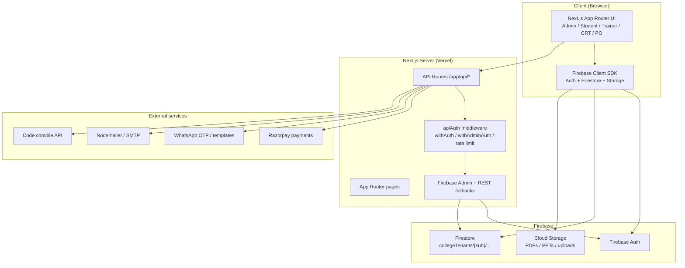

# LMSVawe (vavepro) — System Design

LMSVawe is a multi-tenant Learning Management System built as a **Next.js full-stack app on Firebase**, with role-based access control and college-scoped data isolation.

---

## High-level architecture



---

## Technology stack

| Layer | Choice |
|--------|--------|
| Frontend | Next.js 16 (App Router), React 19, Tailwind CSS 4 |
| Backend | Next.js Route Handlers (`app/api/*`) |
| Auth | Firebase Auth (ID tokens) |
| Database / files | Firestore + Firebase Storage |
| Payments | Razorpay (HMAC signature verification) |
| Messaging | WhatsApp OTP/templates, email (Nodemailer) |
| Deploy | Vercel |

---

## Core design patterns

### 1. Multi-tenant data model

College data is isolated under:

```text
collegeTenants/{collegeSubdomain}/…
```

Legacy global paths still exist for shared/admin data. Tenant helpers live in:

- `lib/tenantPath.js`
- `lib/collegeTenantFirestore.js`

Scoped student roles follow the subdomain, for example:

- `vaweStudent`
- `xyzCrtStudent`
- `xyzInternship`

Default tenant for the main VAWE LMS is `vawe` (`lib/studentRole.js`).

### 2. Role-based access control (RBAC)

Typical roles:

| Role | Responsibility |
|------|----------------|
| `superadmin` / `admin` | Platform and college administration |
| College admin | Tenant-scoped admin |
| `trainer` / `crtTrainer` | Teaching and course delivery |
| Student variants | LMS / CRT / internship / Skillwins |
| PO / active incharge | Placement and classroom operations |

**Client guards:** `CheckAuth`, `CheckAdminAuth`, `CheckTrainerAuth`, etc.  
**Server guards:** `withAuth` / `withAdminAuth` in `lib/apiAuth.js`.  
**Admin context:** `app/Admin/AdminAccessContext.jsx`.

### 3. Hybrid client + server data access

- **Client → Firestore** for most reads/writes (courses, CRT, dashboards).
- **Server APIs** for privileged operations:
  - create / delete users
  - payments
  - WhatsApp messaging
  - secure PDF / PPT delivery
  - backups
  - analytics

### 4. Auth with defensive fallbacks

Token verification path (`lib/apiAuth.js`):

1. Firebase Admin `verifyIdToken`
2. Firebase REST `accounts:lookup` if SDK/decoder fails
3. Controlled JWT / allowlist fallbacks in limited cases

The same fallback pattern is used for Firestore role lookup (SDK → REST).

### 5. Domain modules

| Module | Purpose |
|--------|---------|
| Courses / Assignments | Content, chapters, submissions |
| Practice / Coding | MCQs, Monaco editor, compile API |
| CRT programs | College CRT courses, exams, trainers, PO analytics |
| Internships | Internship course copies and chapter access |
| Interview | Exam links, scorecards, results |
| Admissions / Fees | Forms, Razorpay, receipts, WhatsApp |
| Admin analytics | Dashboards, backups, user management |

---

## Request flow (secured API)

```text
Client (Bearer Firebase ID token)
  → Next.js /app/api/*
  → withAuth / withAdminAuth (+ optional rate limit)
  → Firebase Admin / Firestore / external service
  → JSON response
```

Edge middleware (`middleware.js`) currently passes through and only matches `/superadmin/:path*`.

---

## Cross-cutting algorithms

Documented in `PSEUDOCODE_AND_USED_ALGORITHMS.md`:

1. **Authentication middleware** with multi-level fallbacks
2. **Admin RBAC** with Firestore / REST role lookup
3. **Sliding-window rate limiting** (per IP + route)
4. **OTP verification** with attempts and temporary lockout
5. **Razorpay HMAC** payment signature verification
6. **Student dedup aggregation** across program batches

Related performance notes: `PERFORMANCE_OPTIMIZATIONS.md` (parallel fetches, scoped submission queries).

---

## Key directories

```text
app/                 # App Router pages + API routes
  api/               # Server route handlers
  Admin/             # Admin UI
  crt/               # CRT student/college flows
  courses/           # Course & assignment UI
  practice/          # Practice / coding
  interview/         # Interview exams
components/          # Shared React components
lib/                 # Auth, Firebase, tenants, payments, WhatsApp helpers
public/              # Static assets
```

---

## Deployment shape

**Monolithic Next.js BFF** on Vercel:

- UI and API live in one application
- Firebase provides managed Auth, Firestore, and Storage
- External integrations handle payments and messaging

---

## Related docs

- `PSEUDOCODE_AND_USED_ALGORITHMS.md` — core algorithms and pseudocode
- `PERFORMANCE_OPTIMIZATIONS.md` — course loading optimizations
- `docs/CREATE_TRAINER_FLOW.md` — trainer creation flow
- `MCQ_UPLOAD_FORMAT.md` / `EXCEL_UPLOAD_FORMAT.md` — upload formats
